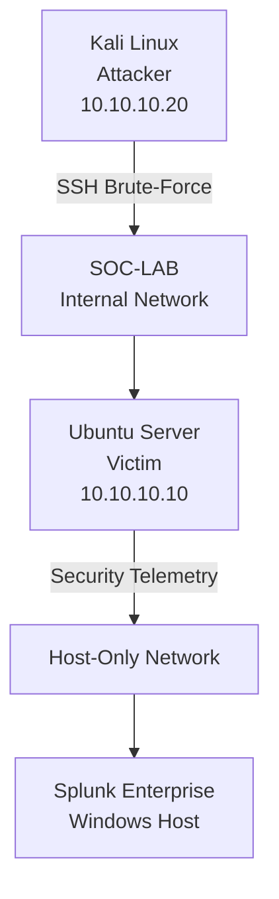

# SSH-Brute-Force-Detection-Response-Lab
A hands-on SOC home lab simulating an SSH brute-force attack, with Splunk-based detection and investigation, firewall containment, and incident documentation.

## Table of Contents

1. [Project Overview](#1-project-overview)
2. [Objectives](#2-objectives)
3. [Lab Architecture](#3-lab-architecture)
4. [Tools & Technologies](#4-tools--technologies)
5. [Attack Simulation](#5-attack-simulation)
6. [Detection](#6-detection)
7. [Investigation](#7-investigation)
8. [MITRE ATT&CK Mapping](#8-mitre-attck-mapping)
9. [Containment](#9-containment)
10. [Validation](#10-validation)
11. [Key Findings](#11-key-findings)
12. [Skills Demonstrated](#12-skills-demonstrated)
13. [Lessons Learned](#13-lessons-learned)
14. [Project Evidence](#14-project-evidence)

## 1. Project Overview

This project demonstrates a hands-on SOC workflow for detecting and responding to an SSH brute-force attack in an isolated home lab environment.

The attack was simulated from a Kali Linux attacker machine against an Ubuntu Server victim. Security telemetry was collected and analyzed using Splunk, followed by investigation, detection logic development, firewall-based containment, and validation.

The project follows a structured SOC incident workflow:

**Attack → Detection → Investigation → Response → Validation → Documentation**

## 2. Objectives

- Build an isolated SOC lab using VirtualBox.
- Simulate an SSH brute-force attack against an Ubuntu Server.
- Collect and analyze authentication telemetry using Splunk.
- Detect and investigate suspicious authentication activity.
- Map the observed attack behavior to MITRE ATT&CK.
- Implement firewall-based containment of the attacking IP.
- Validate the effectiveness of the containment.
- Document the incident and response process as a portfolio project.

## 3. Lab Architecture

The lab consists of an isolated attacker and victim environment, with Splunk running on the Windows host for security monitoring and investigation.

## 4. Tools & Technologies

| Tool / Technology | Purpose |
|---|---|
| **Kali Linux** | Simulated attacker environment and SSH brute-force testing |
| **Ubuntu Server** | Victim endpoint and source of Linux authentication telemetry |
| **Splunk Enterprise** | Security event collection, search, detection, and investigation |
| **VirtualBox** | Hosted the isolated virtual lab environment |
| **UFW** | Firewall-based containment of the attacking IP address |
| **Hydra** | Simulated the SSH brute-force attack |
| **MITRE ATT&CK** | Mapped observed attack behavior to documented techniques |
