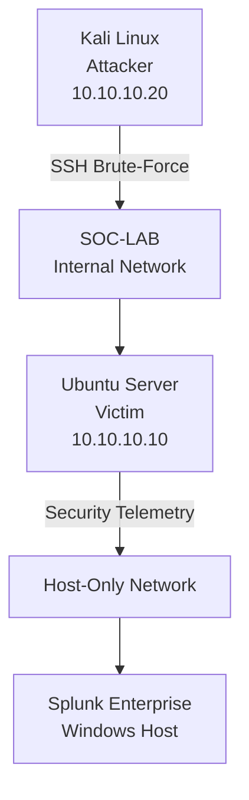

# SSH-Brute-Force-Detection-Response-Lab
A hands-on SOC home lab simulating an SSH brute-force attack, with Splunk-based detection and investigation, firewall containment, and incident documentation.

## Table of Contents

1. [Project Overview](#1-project-overview)
2. [Objectives](#2-objectives)
3. [Lab Architecture](#3-lab-architecture)
4. [Tools & Technologies](#4-tools--technologies)
5. [Attack Simulation](#5-attack-simulation)
6. [Detection](#6-detection)
7. [Investigation](#7-investigation)
8. [MITRE ATT&CK Mapping](#8-mitre-attck-mapping)
9. [Containment](#9-containment)
10. [Validation](#10-validation)
11. [Key Findings](#11-key-findings)
12. [Lessons Learned](#12-lessons-learned)
13. [Project Evidence](#13-project-evidence)

## 1. Project Overview

This project demonstrates a hands-on SOC workflow for detecting and responding to an SSH brute-force attack in an isolated home lab environment.

The attack was simulated from a Kali Linux attacker machine against an Ubuntu Server victim. Security telemetry was collected and analyzed using Splunk, followed by investigation, detection logic development, firewall-based containment, and validation.

The project follows a structured SOC incident workflow:

**Attack → Detection → Investigation → Response → Validation → Documentation**

## 2. Objectives

- Build an isolated SOC lab using VirtualBox.
- Simulate an SSH brute-force attack against an Ubuntu Server.
- Collect and analyze authentication telemetry using Splunk.
- Detect and investigate suspicious authentication activity.
- Map the observed attack behavior to MITRE ATT&CK.
- Implement firewall-based containment of the attacking IP.
- Validate the effectiveness of the containment.
- Document the incident and response process as a portfolio project.

## 3. Lab Architecture

The lab consists of an isolated attacker and victim environment, with Splunk running on the Windows host for security monitoring and investigation.

## 4. Tools & Technologies

| Tool / Technology | Purpose |
|---|---|
| **Kali Linux** | Simulated attacker environment and SSH brute-force testing |
| **Ubuntu Server** | Victim endpoint and source of Linux authentication telemetry |
| **Splunk Enterprise** | Security event collection, search, detection, and investigation |
| **VirtualBox** | Hosted the isolated virtual lab environment |
| **UFW** | Firewall-based containment of the attacking IP address |
| **Hydra** | Simulated the SSH brute-force attack |
| **MITRE ATT&CK** | Mapped observed attack behavior to documented techniques |

## 5. Attack Simulation

A controlled SSH brute-force attack was simulated from the Kali Linux attacker machine against the Ubuntu Server.

The attack targeted the `socadmin` account using a password list and sequential SSH authentication attempts.

**Attack Details**

| Parameter | Value |
|---|---|
| **Attacker** | Kali Linux - `10.10.10.20` |
| **Target** | Ubuntu Server - `10.10.10.10` |
| **Protocol** | SSH |
| **Target Account** | `socadmin` |
| **Attack Type** | SSH Brute Force / Password Guessing |
| **Tool** | Hydra |
| **Attempts** | 12 |
| **Successful Authentication** | 1 |

The simulation generated failed and successful SSH authentication events on the Ubuntu Server, providing the telemetry required for Splunk-based detection and investigation.

**Lab Output:** [View SSH Brute-Force Attack](Screenshots/1-attack-simulation.png)

## 6. Detection

The Ubuntu Server authentication logs were ingested into Splunk and analyzed for repeated failed SSH authentication attempts.

A detection query was developed to identify repeated failures from the same source IP against the same user. The detection threshold was set to **5 or more failed attempts**.

The investigation identified:

- **Source IP:** `10.10.10.20`
- **Target User:** `socadmin`
- **Failed Attempts:** `13`
- **First Seen:** `2026-09-21 01:04:55`
- **Last Seen:** `2026-09-21 01:05:36`

A Splunk alert was also configured using this detection logic to identify similar brute-force activity in future events.

**Lab Output:** [View Splunk Telemetry](Screenshots/2-splunk-telemetry.png)

**Lab Output:** [View Brute-Force Detection](Screenshots/5-brute-force-detection.png)

**Lab Output:** [View Splunk Alert](Screenshots/6-splunk-alert.png)

## 7. Investigation

The detected authentication activity was investigated in Splunk by reviewing failed and successful SSH authentication events and correlating them by source IP and target account.

The investigation established that:

- `10.10.10.20` generated repeated failed authentication attempts against `socadmin`.
- The activity occurred within a short time window.
- A successful SSH authentication was observed after the failed attempts.
- The source IP, target account, authentication method, and event timestamps were consistent across the related events.

This confirmed a coordinated SSH password-guessing activity from the Kali attacker to the Ubuntu Server.

**Lab Output:** [View Failed Authentication Events](Screenshots/3-failed-authentication.png)

**Lab Output:** [View Authentication Timeline](Screenshots/4-authentication-timeline.png)

## 8. MITRE ATT&CK Mapping

The observed activity was mapped to the following MITRE ATT&CK techniques:

| Technique | ID | Observed Activity |
|---|---|---|
| **Password Guessing** | **T1110.001** | Multiple failed SSH authentication attempts against the `socadmin` account |
| **SSH** | **T1021.004** | SSH was used as the remote service during the attack |

These mappings provide a standardized way to describe the observed attacker behavior and align the investigation with the MITRE ATT&CK framework.

## 9. Containment

Following the investigation, containment actions were applied to reduce the risk of further unauthorized access.

**Containment Action**

| Action | Result |
|---|---|
| **Blocked attacker IP** | `10.10.10.20` was blocked using UFW |
| **Reset affected account password** | The `socadmin` password was changed to a new strong password |
| **Preserved SSH service** | SSH remained available while access from the identified source was restricted |

The source IP was blocked to prevent further activity from the identified attacker, while the affected account password was reset to prevent reuse of the credentials that were successfully authenticated during the simulation.

**Lab Output:** [View UFW Containment Rule](Screenshots/7-containment-ufw.png)

**Lab Output:** [View Account Password Reset](Screenshots/8-password-reset.png)

## 10. Validation

The containment was validated from the Kali attacker machine by testing connectivity to the Ubuntu Server after the source IP was blocked.

The results confirmed that:

- ICMP connectivity remained available.
- SSH connectivity was blocked.
- The attacker could no longer establish an SSH connection to the victim.

This confirmed that the firewall containment successfully prevented further SSH access from the identified source IP.

**Lab Output:** [View Containment Validation](Screenshots/9-containment-validation.png)

## 11. Key Findings

The investigation demonstrated the complete detection and response workflow for the simulated SSH brute-force activity.

| Finding | Result |
|---|---|
| **Attack Activity** | SSH brute-force activity was simulated using Hydra |
| **Failed Authentication** | 13 matching failed-password events were identified in Splunk |
| **Successful Authentication** | 1 successful SSH authentication was observed |
| **Attacker Identification** | Source IP `10.10.10.20` was identified |
| **Detection** | Repeated authentication failures were identified using SPL |
| **Containment** | Attacker IP was blocked using UFW and password updated|
| **Validation** | SSH access from the blocked source was successfully prevented |
| **Alerting** | A Splunk detection alert was configured for similar activity |

The lab demonstrated how security telemetry can be used to identify suspicious authentication activity, investigate the associated events, and apply a containment action.

## 12. Lessons Learned

### Detection

Authentication logs provide valuable telemetry for identifying SSH brute-force activity.

### Investigation

Combining the username, source IP, timestamp, authentication result, and service provides sufficient context to establish an initial attack timeline.

### Containment

Firewall rule ordering is important. The deny rule needed to take precedence over the existing SSH allow rule to effectively block the identified source.

### Credential Remediation

Because a successful authentication was observed during the simulation, resetting the affected account password is an important containment step to prevent reuse of the compromised credentials.

### Detection Improvement

The current detection uses a fixed threshold of five failed attempts within a five-minute search window. In a production environment, detection logic could be further tuned to reduce false positives and account for scenarios such as:

- Password spraying
- Multiple targeted accounts
- Distributed attacks from multiple IP addresses
- Legitimate administrative authentication failures

## 13. Project Evidence

The following screenshots document the key stages of the SOC investigation and response workflow.

| # | Project Stage | Screenshot |
|---:|---|---|
| 1 | Attack Simulation | [View SSH Brute-Force Attack](Screenshots/1-attack-simulation.png) |
| 2 | Splunk Telemetry | [View Splunk Telemetry](Screenshots/2-splunk-telemetry.png) |
| 3 | Failed Authentication | [View Failed Authentication Events](Screenshots/3-failed-authentication.png) |
| 4 | Authentication Timeline | [View Authentication Timeline](Screenshots/4-authentication-timeline.png) |
| 5 | Brute-Force Detection | [View Brute-Force Detection](Screenshots/5-brute-force-detection.png) |
| 6 | Splunk Alert | [View Splunk Alert](Screenshots/6-splunk-alert.png) |
| 7 | Firewall Containment | [View UFW Containment Rule](Screenshots/7-containment-ufw.png) |
| 8 | Credential Remediation | [View Account Password Reset](Screenshots/8-password-reset.png) |
| 9 | Containment Validation | [View Containment Validation](Screenshots/9-containment-validation.png) |
